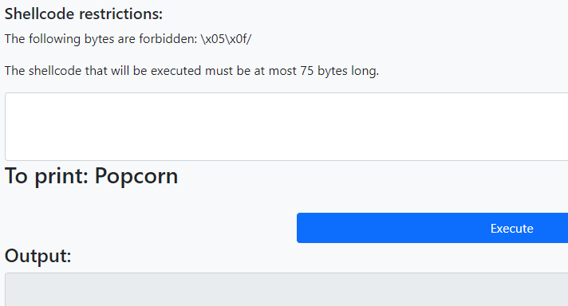
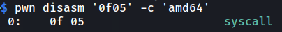
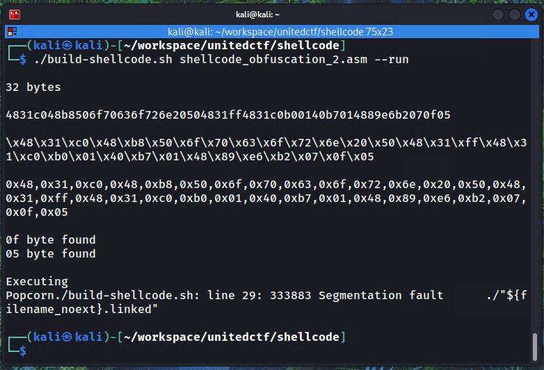
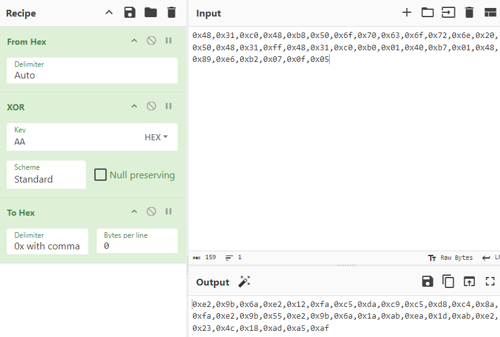
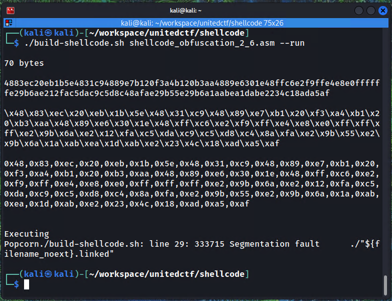
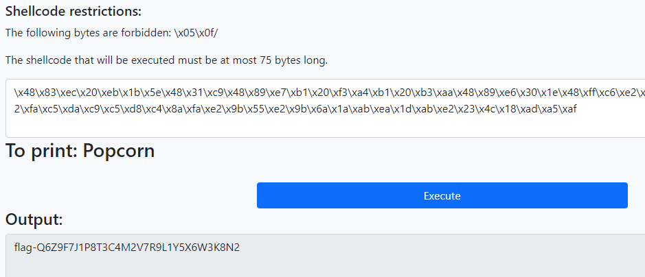

This is the level 2 of the Shellcode Obfuscation series.

General instructions
1. For each level, you must execute code that will print the expected string on STDOUT.
2. The only syscalls allowed are write on stdout and exit.
3. The architecture is AMD64.
4. The shellcode format must be in hexadecimal (`\x00\x01\x02`).
5. The program that runs the shellcode was compiled with `gcc -z execstack -fno-stack-protector -o [executable] [source.c]`

<!-- truncate -->



The main restriction of this challenge is avoiding the `0x05` and `0x0f` bytes which represent the `syscall` opcode



While doing the challenge I couldn't manage to find a easy way to invoke syscall without calling it directly in the code so I figured I would likely want to encode a part of the shellcode to obfuscate the `0x0f05` bytes.

I already had a basic shellcode from the level 1 to start with:

```nasm
section .text
    global _start

_start:
    xor rax, rax
    mov eax, 0x61706170
    push rax
    mov rax, 0x20e0206562726142 
    push rax

    xor rax, rax
    mov al, 0x01
    xor rdi, rdi
    mov dil, 1
    mov rsi, rsp
    mov dl, 13
    syscall
```

It writes a string to the stack and then calls the write syscall. For this challenge, the first part could be modified to the following to print `Popcorn`:

```nasm
section .text
    global _start

_start:
    xor rax, rax
    mov rax, 0x206e726f63706f50
    push rax

    xor rax, rax
    mov al, 0x01
    xor rdi, rdi
    mov dil, 1
    mov rsi, rsp
    mov dl, 7
    syscall
```

Then i searched the web for different basic shellcode obfuscation techniques and stumbled on XORing shellcode directly.

[https://lastlistener.github.io/Courses--SLAE--7_Shellcode_Crypter.htm](https://lastlistener.github.io/Courses--SLAE--7_Shellcode_Crypter.html)

[https://4xura.com/pwn/create-a-shellcode-encoder-for-binary-exploit/](https://4xura.com/pwn/create-a-shellcode-encoder-for-binary-exploit/)

So I did something similar to the links above, I wrote an assembly program that would xor a part of itself using the [jmp-call-pop technique](https://epi052.gitlab.io/notes-to-self/blog/2018-07-15-jmp-call-pop/). I opted to write the shellcode to the stack since while debugging an other solution that xored the shellcode bytes in place, the area was non-writeable and I tought it would also be on the challenge so I just stuck with writing it to the stack which was shown as executable in the challenge instructions.

```nasm
section .text
global _start

_start:
    sub rsp, shellcode_len               ; create room on the stack
    jmp short call_encoded_shellcode

shellcode:
    pop rsi

    ; move the shellcode to the stack
    xor rcx, rcx
    mov rdi, rsp
    mov cl, shellcode_len
    rep movsb 

    mov cl, shellcode_len
    mov bl, 0xaa                         ; XOR key

    mov rsi, rsp 

decode_loop:
    xor byte [rsi], bl
    inc rsi
    loop decode_loop
    jmp rsp

call_encoded_shellcode:
    call shellcode 
    encoded_shellcode:
        db 0x00 ; xored shellcode to encode will be put here

    shellcode_len equ $ - encoded_shellcode
```

Now, the asm code that prints Popcorn can be XORed with `0xaa` and added to the code above. 

I used this toolchain to build assembly code and convert it to shellcode:

> build-shellcode.sh
```sh
#!/bin/bash

if [ -z "$1" ]; then
  echo "Usage: $0 <filename>"
  exit 1
fi

run_flag=false
if [ "$2" == "--run" ]; then
  run_flag=true
fi

filename=$(basename -- "$1")
filename_noext="${filename%.*}"

nasm -f elf64 "$1" -o "${filename_noext}.o"

ld "${filename_noext}.o" -o "${filename_noext}.linked" 
execstack -s "${filename_noext}.linked"

python parse-shellcode.py "${filename_noext}.linked"

if [ "$run_flag" == true ]; then
  echo
  echo "Executing"
  ./"${filename_noext}.linked"
fi
```

> parse-shellcode.py
```python
#!/usr/bin/python3

import sys
from pwn import *

context(os="linux", arch="amd64", log_level="error")

file = ELF(sys.argv[1])
shellcode = file.section(".text")

print(f"\n{str(len(shellcode))} bytes")

print('\n' + shellcode.hex() + '\n')
print(''.join([r'\x{:02x}'.format(c) for c in shellcode]) + '\n')
print(','.join(['0x' + r'{:02x}'.format(c) for c in shellcode]) + '\n')

for c in shellcode:
    if c in [0x00, 0x05, 0x0f]:
        print(r"{:02x} byte found".format(c))
```

Then, compiling and printing the shellcode for the Popcorn asm:



The warning for `05` and `0f` is fine since this is the shellcode that will be XORed to not have them.

The segmentation fault is also fine, it's just that the exit syscall was omitted to reduce the length of the shellcode that must remain under 75 bytes.

Now the shellcode can be xored it with `0xAA` using cyberchef, checking if the output still doesn't contain any prohibited bytes with a quick `ctrl+f`.



The output can then added to the previous asm code

```nasm
call_encoded_shellcode:
    call shellcode 
    encoded_shellcode:
        db 0xe2,0x9b,0x6a,0xe2,0x12,0xfa,0xc5,0xda,0xc9,0xc5,0xd8
        db 0xc4,0x8a,0xfa,0xe2,0x9b,0x55,0xe2,0x9b,0x6a,0x1a,0xab
        db 0xea,0x1d,0xab,0xe2,0x23,0x4c,0x18,0xad,0xa5,0xaf
```

The asm can finally be compiled to produce the final shellcode.

We see no warnings so the prohibited bytes are not present.



This was the final shellcode, which when sent as the answer reveals the flag.

